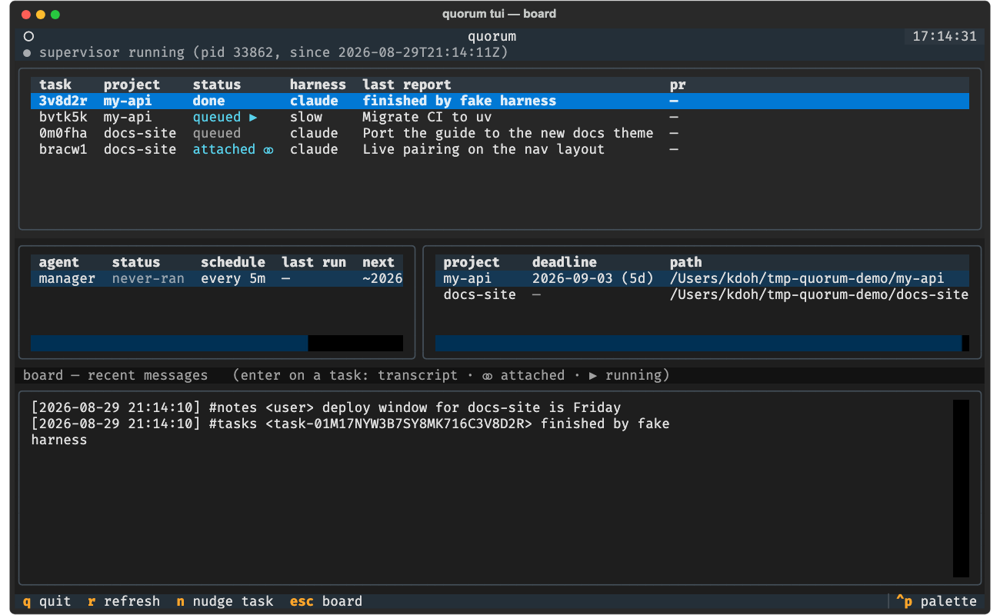
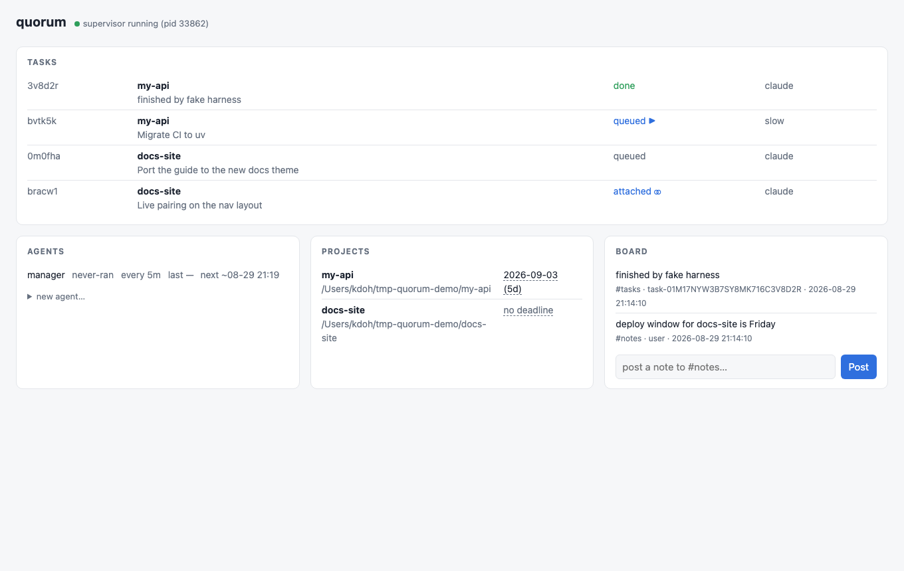

# The quorum guide

Everything you need to run quorum, in one place: concepts, harness
configuration, driving and guiding tasks, the dashboards, sandboxing, and
writing your own agents. (Internals and design rationale live in
[architecture.md](architecture.md).)

- [Concepts](#concepts)
- [Setup](#setup)
- [Harnesses](#harnesses)
- [Tasks](#tasks)
- [The manager](#the-manager)
- [Prompt customization](#prompt-customization)
- [Guiding tasks](#guiding-tasks)
- [Dashboards](#dashboards)
- [Controlling agents at runtime](#controlling-agents-at-runtime)
- [Sandboxing](#sandboxing)
- [Writing your own agents](#writing-your-own-agents)
- [Where everything lives](#where-everything-lives)

## Concepts

Five words carry the whole system:

- **Home** — one directory (`~/.quorum` by default, `$QUORUM_HOME` or
  `--home` to override) holding every durable byte quorum touches. Plain
  JSON/JSONL/TOML/Markdown; `ls` and `cat` are debuggers; copying the
  directory migrates the whole setup. One more resolution rule to know: a
  `quorum-home/` directory in the current working directory wins over
  `~/.quorum` (handy for per-repo experiments, surprising if you forget
  it's there).
- **Project** — a directory you registered with `quorum project add`,
  usually a git repo. Tasks run against projects.
- **Task** — a prompt pointed at a project, executed by a *harness* as a
  sequence of **runs**. Each run is one invocation of the harness in the
  task's working directory (a git worktree by default).
- **Harness** — any coding-agent CLI you already use: `claude`, `codex`,
  `opencode`, or your own script. Quorum never talks to a model API for
  tasks; it invokes your tool and stays out of the way.
- **Manager** — the one built-in agent, and it is *itself* harness-driven.
  Under `quorum up` it periodically reads a digest of everything happening —
  every task's status, output, and liveness, plus its own recent actions and
  your directives — and then *your harness* decides what to do: launch
  queued tasks, poke stuck ones, relaunch dead ones, create follow-up work,
  or escalate to you. Supervision policy is a prompt you can edit
  (`prompts/manager.md`), not code.

Communication is file-based messaging: a public **board** (topics anyone can
read) and per-recipient **inboxes**. Your guidance and the manager's pokes go
into a task's inbox; the harness reports progress back with the `quorum` CLI
itself; and the manager has its own inbox for your directives.

## Setup

```bash
uv tool install quorum-orchestrator              # `quorum` command + TUI dashboard
uv tool install "quorum-orchestrator[web]"       # add the localhost web dashboard
quorum init                    # scaffolds ~/.quorum and a starter config.toml
quorum doctor                  # after editing config.toml: check it against
                               # reality (see "Checking your setup" below)
```

The supervisor runs however you prefer: `quorum up` in the foreground
(Ctrl-C stops it), or `quorum up --detach` in the background with output in
`logs/supervisor.log` — `quorum down` stops a detached (or any) supervisor.

`config.toml` is yours: quorum reads it and **never writes it back**. The
scaffold contains commented examples of everything below. The `[tasks]`
section sets defaults:

```toml
[tasks]
worktree = true         # run each task in its own git worktree under QUORUM_HOME
default_harness = ""    # harness used by `quorum task add` and the manager
auto_commit = false     # after each run, commit whatever the harness left
                        # uncommitted in its worktree (safety net; see below)
max_cost_per_run = 0    # 0 = off. Flag a run that reported spending more
max_tokens_per_run = 0  # than this — an observation, never a kill switch
```

`auto_commit` is the belt to the delivery protocol's braces. Harnesses are
told to commit and push before reporting done, and quorum flags a task whose
worktree still holds uncommitted or unpushed work — but a harness that
crashes mid-edit obeys neither. Turn this on and the runner commits anything
left behind onto the task branch (`quorum: auto-commit uncommitted work
after run`, bypassing commit hooks and signing — the run is unattended), so
it can be reviewed or reset later instead of vanishing with the worktree.
It never pushes; never touches a `--no-worktree` task, which runs in your
own checkout; leaves a task alone once its harness reported `done` (the
finished tree is the harness's statement, not quorum's to amend); and
declines a detached HEAD or half-finished merge rather than commit
something misleading — the tree then stays dirty and flagged as stranded.
Each rescue (or failure) is noted in the transcript and on the run's entry
in `task.json`. One interaction to know: with `[sandbox] use_nono = true`
the sandboxed runner cannot run git after the harness exits, so the net
skips with a transcript note — rely on the stranded-work flag there.

**What runs cost.** Most coding harnesses report their token and cost usage
when they finish a turn (claude's `result` event, codex's `turn.completed`),
and quorum records whatever it sees on the run's entry in `task.json`. It
then shows up wherever tasks do — `$0.42 · 11.0k tok` on a `quorum status`
row, broken out by `quorum task show`, summed per task in the manager's
digest. A harness that reports nothing is fully supported: you simply see
nothing, never a misleading `$0.00`.

Set `max_cost_per_run` or `max_tokens_per_run` and a run that reported more
than that gets marked (`$!` in the views, `BUDGET-EXCEEDED` in the digest).
The budget also gates the **next** run: while a task's *last* run is over
budget, `quorum task run` refuses it (`$! GATED` in `task list`, a `gated:`
line in `task show`, and the TUI's `s` key says so) until you run it with
`--force` or a run comes in under budget — a run that reports no usage
counts as under, since silence is not spend. Quorum never kills a run in
progress: a run past its budget finishes, and only the relaunch is held.
The digest tells the manager the gate is on, and its prompt tells it not to
reach for `--force` by reflex but to sharpen the nudge, split the task, or
escalate to you first. With no budget set (the default) nothing is ever
gated.

## Harnesses

A harness entry tells quorum how to invoke your tool. `{prompt}` and
`{session}` are substituted into the argv; a template with no `{prompt}`
gets the prompt appended as the final argument.

```toml
[harness.claude]
start  = ["claude", "-p", "{prompt}", "--output-format", "stream-json", "--input-format", "stream-json", "--verbose",
          "--allowedTools", "Edit", "Write", "Read", "Bash(git:*)", "Bash(quorum:*)", "Bash(gh:*)"]
resume = ["claude", "-p", "{prompt}", "--resume", "{session}", "--output-format", "stream-json", "--input-format", "stream-json", "--verbose",
          "--allowedTools", "Edit", "Write", "Read", "Bash(git:*)", "Bash(quorum:*)", "Bash(gh:*)"]
inject = "stream-json"   # deliver nudges into a *running* session (see below)

[harness.codex]
start  = ["codex", "exec", "--json", "{prompt}"]
resume = ["codex", "exec", "resume", "{session}", "--json", "{prompt}"]

[harness.opencode]
start = ["opencode", "run", "{prompt}"]

[harness.myscript]
start = ["/usr/local/bin/my-agent.sh"]        # prompt appended as last arg
env   = { MY_AGENT_MODE = "headless" }
```

Notes:

- **Sessions.** Quorum scans the harness's stdout for JSON containing a
  `session_id` (claude) or `thread_id` (codex `exec --json`) and stores it
  on the task. When the harness has a `resume` template and a session is
  known, later runs use it — the agent continues its own conversation.
  Without either, every run starts fresh; that still works, because the
  worktree (and everything the previous run wrote there) persists between
  runs.
- **Mid-run nudges.** By default, `quorum task nudge` reaches the harness
  at the start of its *next* run. A harness that speaks the Claude Code
  stream-json protocol can do better: set `inject = "stream-json"` and pair
  `--input-format stream-json` with `--output-format stream-json` in its
  templates (both matter — the runner writes user turns to the harness's
  stdin, and it watches stdout `result` events to know when the harness is
  idle so it can end the run). With `inject` set, stdin becomes the *only*
  prompt channel: a stream-json CLI ignores an argv prompt entirely, so the
  runner delivers the composed prompt as the opening user turn and drops any
  `{prompt}` element from the template (`claude -p "{prompt}" ...` is
  invoked as `claude -p ...`; you can omit `{prompt}` from inject templates
  altogether). A nudge sent while the run is live then reaches the agent at
  its next turn boundary, in the same session, no new run needed; the run
  ends on its own at the first idle turn with an empty inbox. Don't set
  `inject` without the flags: a harness that never emits stream-json
  `result` events will wait on stdin indefinitely — and don't pair the
  flags with an unset `inject`, or the CLI waits for a stdin prompt the
  runner never sends.
- **Autonomy flags.** Runs are unattended: a harness that stops to ask for
  interactive permission stalls silently on its first denied tool call, and
  the manager will eventually poke and resume it to no effect. Grant
  permissions explicitly. **Prefer a scoped allowlist** like the
  `--allowedTools` list above — it covers editing files, git, `gh` for the
  PR step, and quorum's own progress protocol (`Bash(quorum:*)` is what lets
  the harness call `quorum task report` / `quorum task inbox`) — over
  blanket bypasses like `--dangerously-skip-permissions`. Whatever you
  grant, pairing it with the [sandbox](#sandboxing) keeps the blast radius
  to the worktree, not your machine.
- **Environment.** The run inherits your environment plus the harness's
  `env` table, with `QUORUM_HOME` set — that's how `quorum task report`
  inside the run finds the right home.

## Checking your setup

Nearly everything in quorum fails soft, on purpose: a `gh` that is installed
but not logged in just stops producing CI observations, an unparseable
`config.toml` quietly turns the optional probes off, a prompt left behind by
an upgrade keeps rendering last release's policy, a crashed run leaves a
`runner.lock` that skews how idle a task looks. Those are the right runtime
behaviours, and they are precisely why none of them announce themselves.

```bash
quorum doctor                  # one line per check; exits 1 if anything is ✗
quorum doctor --json           # the same checks, for scripts
quorum doctor --smoke          # ...and run the default harness once, for real
quorum doctor --smoke codex    # ...that one instead
```

```
home: /Users/you/.quorum
  ✓ config.toml parses (strict)
  ✓ git 2.49 at /opt/homebrew/bin/git
  ✓ harness 'claude': claude on PATH (/Users/you/.local/bin/claude)
  ✓ harness 'claude': prompt injected over stdin (inject = 'stream-json')
  ✓ default harness: claude
  ✓ project my-api: /Users/you/work/my-api
  ✗ gh is installed but not authenticated — every ci: line silently disappears
      → run `gh auth login` (or export GH_TOKEN), or set [ci].enabled = false
  – [sandbox].use_nono = false — task runs are not sandboxed
  ✗ prompts/manager.md is an older packaged default, never edited — this home
    is running last release's policy
      → run `quorum init`: it upgrades unedited seeds in place
  ✓ supervisor running (pid 40680, since 2026-08-31T23:40:50Z)
```

`✓` is fine, `✗` is a problem, and `–` means there was nothing to check —
something you switched off, never configured, or that could not answer
(a `gh` that timed out is `–`, not a failure: offline says nothing about
whether you are logged in). Only `✗` affects the exit code, so a `–` never
trains you to ignore the output — a freshly `init`ed home with no harness
chosen yet says so in one `–` line and exits 0. Doctor **diagnoses and
never repairs**: every `✗` names the fix, and applying it stays your call.

What it looks at: the home and a *strict* parse of `config.toml` (this is
the one place a broken file is reported rather than papered over with
defaults); every `[harness.*]` table — argv[0] on PATH, a template that can
actually carry a prompt, `{session}` wherever a `resume` template promises
one, and argv that speaks stream-json without `inject` set; `[tasks].default_harness`;
git and each registered project directory; `gh` when `[ci]` is on, the herdr
socket when `[herdr]` is, and nono-py when `[sandbox]` asks for it; each
`prompts/` file against the packaged default (`default` / an unedited older
seed `quorum init` would upgrade / your own edit over a default that has
since moved); and the state earlier runs left behind — a supervisor lock
whose pid is gone or whose heartbeat stopped, an installed version newer
than the running supervisor's, orphaned `runner.lock`s, inbox messages
claimed and never acked, agents with a failure streak.

**`--smoke` is the one thing doctor does actively**, and the only one that
spends tokens: it runs your harness once, in a scratch directory, through
the runner's own code — the same argv building, the same stdin injection for
an `inject` harness, the same transcript streaming — and asserts that it
produced a `result` event and a session/thread id before a short timeout
(`--smoke-timeout`, 60s by default). The run is walled off from your setup:
a scratch working directory *and* a scratch `QUORUM_HOME`, so a harness with
quorum's integration hooks installed cannot touch your real tasks, and the
timeout kills the harness's whole process tree rather than leaving a wrapped
CLI's children running. Everything static can be green while
the harness still answers with nothing quorum can use; that is exactly the
shape of the outage that motivated this command, where a stream-json CLI
ignored its argv prompt and every run hung until it timed out.

## Tasks

```bash
quorum project add ~/work/my-api
quorum task add my-api "add rate limiting to the public endpoints, then open a PR"
quorum task add my-api "migrate the test suite to pytest" --harness codex
quorum up                      # the manager launches queued tasks
```

A prompt does not have to survive shell quoting. `-` reads it from stdin and
`--prompt-file` reads it from a file, both verbatim — so queuing a GitHub
issue is a one-liner, and quorum never has to learn about `gh`:

```bash
gh issue view 14 --json title,body -q '"\(.title)\n\n\(.body)"' \
  | quorum task add my-api -

quorum task add my-api --prompt-file ~/notes/migration-plan.md
```

Pass the prompt exactly one way — an argument, `-`, or `--prompt-file`; two
at once is an error, and so is empty input.

You can also drive runs by hand — no supervisor required:

```bash
quorum task run a3f2k9             # one run, in the foreground
quorum task run a3f2k9 --detach    # same, backgrounded
```

Task ids are short random handles (`quorum task list` shows them); any
unique prefix or suffix of the full id works everywhere.

**Worktrees.** By default each task gets `~/.quorum/worktrees/<id>`, a git
worktree on branch `quorum/<short-id>` of your project. Parallel tasks never
collide, your checkout stays clean, and abandoning a task is
`git worktree remove` plus `git branch -D` — nothing in your repo moved.
Use `--no-worktree` to run directly in the project directory instead.

**The protocol.** Every run's prompt starts with a preamble
(`~/.quorum/prompts/task-preamble.md`, editable) that teaches the harness:

```
quorum task report <id> --status <word> "<note>"     # at every phase change
quorum task inbox <id> --claim                       # check for guidance
quorum task report <id> --status pr --pr-url <url> "<title>"
quorum task report <id> --status done "<summary>"
quorum task report <id> --status blocked "<what you need>"
```

Status is **free-form** — quorum records whatever word the harness reports
and displays it. The conventional flow is `planning → executing → reviewing
→ pr → done`, but nothing is enforced. Only `done`, `blocked`, and
`cancelled` mean anything to quorum itself: they end the manager's
attention.

### Perpetual tasks

Some jobs never finish: watch CI and fix what breaks, keep the changelog
current, groom the backlog. Queue those with `--perpetual`:

```bash
quorum task add my-api "watch CI on open PRs; fix what breaks, one at a time" --perpetual
```

Nothing about the machinery changes — it is still a task, still runs in a
worktree, still reports free-form statuses. What changes is how three things
read it:

- its prompt gets an extra block (`prompts/task-perpetual.md`, yours to
  edit): work in **cycles**, commit and push at the end of *each* cycle
  rather than "before finishing", report a changing word per cycle
  (`cycle-4`, `idle`) so an unchanging one still means something, and never
  report `done`;
- the manager relaunches it whenever its runner dies — the same rule as any
  unfinished task, which for this one is the loop itself — and its prompt
  tells it not to read a long run count or a cycling status as stuck, and
  never to cancel it;
- quorum withholds the `possible-loop` note for it (repeating the same few
  calls is the job), and every view badges it `∞`.

You end it, with `quorum task cancel <id>`. Two things to expect:

- **it reuses one worktree and one session forever**, so the harness's
  context grows with every cycle. When that starts to bite, reset it:
  clear `"session"` in `~/.quorum/tasks/<id>/task.json` and the next run
  starts a fresh session in the same worktree, keeping the work;
- **the manager's schedule is the floor on cycle latency** — with the
  default `every 5m` tick, a cycle that ends waits up to five minutes for
  the next one to start. Tighten the manager's schedule if you need a
  tighter loop;
- **it keeps the manager awake** — the manager skips its harness run on an
  idle home, and a home with a perpetual task is never idle, so expect one
  manager run per tick for as long as the task lives. `quorum status` shows
  what those runs cost on the manager's row.

### Chaining tasks with `--after`

Some work only makes sense once other work has landed. `--after` says so:

```bash
quorum task add my-api "add rate limiting, open a PR" --harness claude
# → queued task a3f2k9 on my-api

quorum task add my-api "review the rate-limiting PR and fix what you find" \
    --after a3f2k9
# → queued task b7c1x4 on my-api
#   waits on: a3f2k9 — `task run` refuses until they finish (--force overrides)
```

`--after` is repeatable (`--after a3f2k9 --after d4e5f6` waits for both) and
takes the same short handles as everything else; the ids are global, so a
task in one project may wait on a task in another. An unknown handle fails
the command — nothing is queued — and so does `--after` a
[perpetual task](#perpetual-tasks): it never finishes, so anything waiting
on it would wait forever.

What this *does*: while a dependency has not reached a terminal status, the
dependent shows `waiting-on a3f2k9` in `quorum status`, `task list`,
`task show`, the TUI and the dashboard; the manager's digest marks the same
thing and its prompt tells it not to launch such a task; and `quorum task
run` refuses it outright (`--force` if you disagree). Once every dependency
is `done`, the task is an ordinary queued task and the manager picks it up
on its next tick.

What this is **not**: a workflow engine. Nothing schedules on dependencies,
nothing runs automatically the instant an upstream finishes, and quorum
never cancels or reorders anything for you.

**Only a dependency that still might finish holds a task back.** If one ends
`blocked` or `cancelled`, or its task record is deleted outright, it can
never be satisfied — so quorum stops calling the dependent "waiting" and
flags `DEP-FAILED` / `DEP-MISSING` instead, in the digest and in every view.
The task becomes runnable again and the decision is a visible one, for the
manager or for you: nudge the dependency, launch the dependent anyway if its
premise still holds, or cancel it. A dependency that silently blocked forever
would have hidden exactly that choice.

**How the dependent reads the upstream's result.** Its prompt gains a block
naming each dependency with its status and PR url:

```
# Tasks this one depends on

- a3f2k9: status=done pr=https://github.com/you/my-api/pull/42
  it was asked to: add rate limiting, open a PR

Read the full record of any of them — reports, PR url, branch — with
`quorum task show <id>`.
```

`quorum task show <id>` (add `--json` for the raw record) is the rest of the
channel: reports, branch, runs, spend. That is the whole mechanism — the
harness has the CLI and `QUORUM_HOME`, so nothing else is needed.

**The review-task recipe.** Queue both at once and let the manager sequence
them:

```bash
quorum task add my-api "implement issue #14 and open a PR" --harness claude
quorum task add my-api \
  "review the PR opened by the task you depend on: read its diff with \
   \`gh pr diff\`, fix what you find on its branch, and report done with a \
   summary of the changes you made" \
  --after <the first task's id>
```

The reviewer cannot start before the PR exists, so it never spends a run
reviewing nothing — and if the implementation ends up `blocked`, the digest
says `DEP-FAILED` instead of silently launching a review of a PR that will
never come.

**Watching.**

```bash
quorum task list                  # every task, one line each (cost too, when reported)
quorum task show a3f2k9           # what/where/how it stands (--json: raw record)
quorum task tail a3f2k9 -f        # live transcript (the harness's stdout)
quorum status                     # tasks alongside agents and projects
```

**Finishing and undoing.** A task that opens a PR reports the URL, which
shows up in every view. `quorum task cancel <id>` stops the manager's
attention (`--kill` also SIGTERMs a live runner, and asks first on an
interactive shell — `--yes` skips). The work itself lives on the
`quorum/<short-id>` branch either way.

**Delivery.** The preamble also teaches the harness to deliver with plain
git — commit everything and `git push -u origin HEAD` before reporting
`done` — with no assumption that `gh`, `glab`, or any forge CLI is
installed; opening a PR is a bonus when the tooling happens to exist,
otherwise the pushed branch is the deliverable. Quorum also verifies:
every view flags a task whose working directory holds uncommitted changes
or unpushed commits (`⚠ 2 uncommitted, 1 unpushed` in `quorum status`),
and the manager's digest marks a finished task in that state as
`STRANDED-WORK` — the default manager prompt relaunches it with a nudge to
commit and push, so work can't silently rot in a worktree.

## The manager

Supervision in quorum is not a set of thresholds — it's your harness reading
the situation and deciding. On its schedule (default every 5 minutes, only
when there is something to manage), the manager compiles a **digest**:

- every active task — status, whether its runner process is alive, how long
  it has been quiet, its recent reports and the tail of its output;
- a `possible-loop` note on a task whose current run's recent output is
  dominated by the same tool call repeated — the kind of stuck that looks
  busy from outside. Quorum never halts the run over it: it's an observation
  the manager reads and judges, and the default prompt tells it to check the
  tail first. (Only harnesses that stream JSON events are observable this
  way — a plain-text harness never gets the note, so its absence means
  nothing there);
- a `ci:` line for any task whose branch has a pull request — its state
  (`state=open` / `merged` / `closed`), check counts, the names of the
  failing checks, and `MERGE-CONFLICT` when the branch no longer merges. A
  task that reported `done` over red checks is marked
  `CI-FAILING`, the same way work left uncommitted is marked
  `STRANDED-WORK`: pushed is not the same as working. A **merged** task never
  carries that mark — merged is delivered, and the default prompt reads it as
  "needs nothing from you". This needs `gh` on
  PATH and authenticated; without it (or without a PR yet) the line is
  simply absent, and nothing else changes. Turn the probe off with
  `enabled = false` under `[ci]` in config.toml — it costs one `gh` call per
  task per tick (capped at 12 probed tasks and 10s each, so a hung network
  delays a tick by a bounded couple of minutes at worst, never forever).
  Whatever state the probe sees is also written to the task's record, which
  is what puts the `✔` on the row — see [below](#merged-pull-requests);
- what each task has spent, when its harness reports usage, and a
  `BUDGET-EXCEEDED` note per run past a `[tasks]` budget you set — with
  `(next run gated; --force to override)` when it was the last run, since
  `task run` will refuse that task until a cheaper run clears it
  (*What runs cost*, under [Setup](#setup) above); never a mid-run stop;
- what the manager's **own** runs have cost, when its harness reports usage:
  supervision is not free, and in a busy home it is the steadiest recurring
  bill. The same figure shows up next to the agent in `quorum status`, the
  TUI and the web dashboard;
- `perpetual=true` on any task queued with `--perpetual`
  ([above](#perpetual-tasks)), which the default prompt reads as "relaunch
  forever, never call it stuck, never cancel";
- `waiting-on=<ids>` on a task queued with [`--after`](#chaining-tasks-with---after)
  whose dependencies have not finished — the prompt tells the manager not to
  launch it yet (the runner refuses anyway) — and `DEP-FAILED` /
  `DEP-MISSING` when a dependency ended `blocked`/`cancelled` or lost its
  record, neither of which blocks anything: they are decisions for the
  manager, not rules quorum acts on;
- the manager's own **recent actions with observed outcomes** ("you nudged
  a3f2k9 at 14:02; status UNCHANGED since") — auto-recorded, so the manager
  never loops on an intervention that isn't working;
- its **notebook** — standing notes it (or you) wrote for future runs, at
  the top of the digest and under their own budget ([below](#the-notebook));
- your directives.

It then runs your harness over that digest with `prompts/manager.md` — and
that prompt file *is* the supervision policy. Edit it to change how your
manager behaves: how patient it is, when it escalates, how it words its
pokes. Delete it to restore the default. For a few lines of house policy,
though, prefer the overlay: [Prompt customization](#prompt-customization)
below. The manager acts through the same
CLI you use — launching tasks, nudging them, cancelling them, even creating
follow-up tasks with `task add` — and every action lands in an auditable
journal:

```bash
quorum manager tell "prioritize the api task; park the docs work"   # steer it
quorum manager journal                    # audit everything it has done, and why
quorum manager notes                      # its notebook: what it remembers
```

A `tell` is normally read at the start of the next tick. If the manager's
harness sets `inject = "stream-json"` (see [Harnesses](#harnesses)), a
directive sent while a tick's run is in flight is delivered into that run
as a user turn instead of waiting.

Two things bound a bad run, neither of which second-guesses a decision: a
per-run action cap (`max_actions_per_run`, default 20), and your own eyes on
the journal. The cap is not silent: when a run reaches it, the refusal is
recorded in the journal as `cap.hit`, so the *next* run sees that the last
one ran out of budget (and the default prompt tells it to escalate to you
rather than try a third time).

The manager also sees a few lines about *itself* at the top of every digest
— what its recent runs have cost, how its last five runs ended
(`ok 2m10s · TIMEOUT 15m00s · ...`), and the action budget for this run.
They are observations, exactly like the ones it gets about tasks: nothing
pauses, throttles or changes anything, and the prompt decides what to do
about a run of timeouts. A prompt agent gets the same lines wherever its
template writes `{notes}`.

The mechanics behind all of this — the digest's exact contents, the actor
env tag, the journal format — are in
[architecture.md](architecture.md#the-manager).

**When the LLM service is down, supervision halts loudly — and heals
itself.** There is no dumbed-down fallback: the manager's tick simply fails
(visible in `quorum status` and on the board), but its schedule keeps firing
(`auto_pause = false`), so the first tick after service returns reads the
state of the world from files and relaunches whatever died in the meantime.
You don't have to do anything.

You do, however, get told. Individual failures go to the **system** board,
which nothing nags you about — but after five consecutive failed ticks the
supervisor posts `agent.failing` to the **attention** board, the banner
`quorum status`, the TUI and the web dashboard all show. An agent that is
never paused would otherwise fail all night in a channel nobody watches;
this is the one failure quorum will interrupt you about. It is one post per
outage, not per tick, and when the manager ticks again a matching
`agent.recovered` lands on **system** — the outage is over and there is
nothing for you to do, so it does not add to the banner:

```
$ quorum status
supervisor: running (pid 4711, since 2026-08-30T22:10:04Z)
⚠ 1 on #attention in the last 7d — `quorum board read attention`

$ quorum board read attention
[2026-08-30 23:05:12] attention <supervisor> agent.failing: agent manager
has failed 5 consecutive ticks and is not auto-paused (auto_pause = false),
so it keeps retrying — last error: manager harness run 01K2… exited 1
```

### The notebook

Every tick is a fresh run with no memory: the digest is all the manager
knows. Its action journal covers what it just did, but that window scrolls —
a fact worth keeping ("that PR is waiting on you", "these tests need a
running postgres") would be gone by tomorrow morning. So the manager has a
notebook, and it is the first thing in every digest:

```bash
quorum manager remember "task a3f2k9's PR is waiting on my review"
quorum manager remember "codex is rate-limited today" --ttl 2   # expires itself
quorum manager notes                       # what it currently remembers
quorum manager forget k7f2ab                # retire one (by the id `notes` prints)
```

You and the manager write to the same notebook — a note from you reads as
standing guidance, which is the difference from `manager tell`: a `tell` is
a one-shot directive, claimed and consumed by the next tick, while a note
stays until it expires or someone retires it. Nothing else writes there: a
task reaches the manager with `task report` and the board, and quorum
refuses a `remember` that comes in tagged as a task or another agent, so no
amount of task chatter crowds your notes out. (That refusal is a
convention, not a security boundary — quorum decides who is calling from an
environment variable, and a determined harness could set it. What actually
confines a task run is the sandbox, if you use one.) A busy home cannot
crowd the notebook either — it has its own bounded slot in the digest, ahead
of the task section, so ten noisy tasks cannot shrink it. When it overflows
the digest says how many older notes it dropped (and, if the file has grown
past the window readers scan, how many bytes it did not read), and the
default prompt tells the manager to consolidate: one note that supersedes
several, then `forget` the rest.

The same file exists for every agent (`quorum manager remember --agent
<name>`, stored under `state/agents/<name>/`), and a prompt agent sees its
own notebook — and the same self-observation lines above it — wherever its
template writes `{notes}`. Both dashboards show an
agent's notebook when you select it.

## Prompt customization

Every prompt quorum uses is a file in `~/.quorum/prompts/`: the manager's
constitution (`manager.md`), the task preamble (`task-preamble.md`), the
perpetual block (`task-perpetual.md`), and one per prompt-driven agent.
`quorum init` seeds them, and deleting one restores the packaged default.
Re-run `quorum init` after upgrading quorum: a prompt you never edited is
refreshed to the new packaged default (quorum recognizes a pristine seed by
hash), and one you did edit is left alone.

There are two ways to change one, and the difference matters:

- **An overlay — `prompts/<name>.local.md`.** Yours alone: never seeded,
  never read by `quorum init`, never upgraded. Its text is merged into the
  template at the `{local}` slot (the packaged `manager.md` puts the slot
  right before "How to work", so house rules land above the general
  guidance; `task-preamble.md` puts it after the delivery protocol, and
  `task-perpetual.md` after the cycle conventions). A template without a
  slot — one you rewrote yourself — gets the overlay prepended instead. No
  overlay file, or an empty one, renders to nothing; so does one quorum
  cannot read (a bad overlay never breaks a run — `quorum prompt list`
  flags it instead).
- **Editing `<name>.md` itself.** Still supported, still wins outright. But
  an edited file is *yours* from then on: `quorum init` will never upgrade
  it, so every later improvement to the packaged default stops reaching this
  home. Init says so, and `quorum prompt diff <name>` shows you exactly what
  you are missing.

House rules ("run one task at a time", "always open draft PRs") belong in an
overlay. Rewriting how supervision fundamentally works belongs in the file.

```bash
quorum prompt list                # each template: default, seeded, or edited (+ overlay)
quorum prompt diff manager        # your copy vs the packaged default
```

**Migrating a home that already edited a prompt** — one step, and it is
worth doing, because an edited `manager.md` from a few releases ago has no
policy for whatever the digest has learned to report since:

```bash
quorum prompt diff manager                      # see what the upgrade brings
$EDITOR ~/.quorum/prompts/manager.local.md      # paste ONLY your own lines here
rm ~/.quorum/prompts/manager.md && quorum init  # take the current default back
```

After that, `quorum init` keeps `manager.md` current forever and your
`manager.local.md` rides on top of every future version of it.

## Guiding tasks

The steering channel for individual tasks is the task's inbox, and you and
the manager use it identically:

```bash
quorum task nudge a3f2k9 "use the middleware approach, not decorators"
```

The **next run starts with the guidance in its prompt** (a "Guidance
received" section), and a cooperative harness that checks
`quorum task inbox --claim` mid-run sees it sooner. The TUI makes this
fluid: select a task, press `n`, type, enter. The web dashboard has the same
nudge box on each task. The manager takes direction the same way, through
its own inbox — `quorum manager tell "prioritise the release tasks"`, or `m`
in the TUI.

## Adopting a live session

Sometimes the work is already underway — you're deep in a problem inside an
interactive coding session and want quorum's manager watching over it.
Adopt the session instead of re-queuing the work:

```bash
quorum task adopt "refactoring the auth flow"    # from the session's directory
```

or from inside the session itself, with the shipped adapter for your
harness — install one with `quorum integration install <harness>` (codex and
opencode; `claude-code` goes through Claude's plugin manager, and the command
prints the exact invocation). `quorum integration list` shows what's bundled
and what's installed. Each `integrations/<harness>/README.md` has the
details and per-project variants:

- **Claude Code** ([integrations/claude-code/](../integrations/claude-code/README.md)):
  `/quorum:adopt <desc>`, plus Stop/SessionEnd hooks.
- **Codex CLI** ([integrations/codex/](../integrations/codex/README.md)):
  `/prompts:quorum-adopt <desc>`, plus SessionStart/Stop/SessionEnd hooks —
  Codex speaks the same hook protocol as Claude Code. Adoption starts
  id-less (Codex prompts can't see their own session id); the next hook
  firing learns it by directory match.
- **opencode** ([integrations/opencode/](../integrations/opencode/README.md)):
  `/quorum-adopt <desc>`, backed by a plugin that watches idle events and
  injects guidance as a user turn.

Adoption creates an **attached** task (`⚭` in every dashboard): its workdir
is your own checkout, quorum never spawns runs for it (`task run` refuses,
by design), and the manager treats it as human-driven — observing its git
state and reports, nudging rather than relaunching, escalating to the
`attention` topic if it looks abandoned. Guidance queued with `task nudge`
is delivered *inside* the session by the adapter the next time the agent
stops or goes idle, as an instruction to continue; the session can also call
`quorum task report` like any harness. If the directory wasn't a registered
project yet, adoption registers it. When the interactive phase is over,
`quorum task detach <id>` turns it back into an ordinary task the manager
may run headless (a captured session id lets a `resume` harness template
continue the same conversation).

How attached tasks are represented, how hooks match a session to a task,
and why the runner refuses to run one: see
[architecture.md](architecture.md#attached-tasks-adopting-a-live-session).

### herdr (optional)

If you run your interactive sessions inside [herdr](https://herdr.dev) —
a terminal multiplexer that detects coding agents in its panes — tell
quorum which pane hosts the session:

```bash
quorum task adopt "port the parser" --herdr-pane w1:p2
```

Two things light up, both fail-soft (herdr stopped or absent changes
nothing): the manager digest shows the pane's live agent status
(`herdr: state=working|blocked|idle`), and every `task nudge` also rings a
doorbell in the pane telling the session guidance is waiting — which is how
nudges reach sessions with no quorum adapter installed. The
guidance itself always stays in the task inbox; the session collects it
with `quorum task inbox <id> --claim`. An optional `[herdr]` table in
config.toml overrides the socket path (`socket = "..."`) or disables the
integration (`enabled = false`).

## Dashboards

All views read the home directory and nothing else — they work whether or
not the supervisor is running, including over SSH, and never hold locks.
What they *write* is a short list of steering affordances (nudge a task,
tell the manager, run, cancel, and in the browser a few more), each one the
same call the CLI makes.

Escalations are surfaced everywhere: recent posts on the `attention` topic
(the manager's ask-a-human channel) show up as a warning line in `status`,
in the TUI banner, and as a badge in the web header, so a manager asking
for you is never silent.

- `quorum status` — one-shot text: supervisor liveness, agent heartbeats,
  tasks, project deadlines, and the `#attention` warning when something
  needs you. `--legend` explains the glyphs; `--json` emits the whole
  overview for scripting (so do `task list`, `project list`, and
  `agent list`).
- `quorum tui` — live terminal dashboard, installed by default. Tasks on
  top; arrow around freely, press enter on a task to open its transcript
  and reports in the bottom pane (the header above the pane always says
  which view you're in). The agents table shows each agent's status,
  schedule, what its own harness runs have cost (when the harness reports
  it), and its last and next run (`~` marks an estimate computed from the
  schedule when the supervisor isn't around to say for sure). The keys:

  | key | does |
  | --- | --- |
  | `enter` | open the highlighted task's transcript and reports |
  | `esc` | back to the board feed (or cancel what you're typing) |
  | `n` | nudge the highlighted task — guidance into its inbox |
  | `m` | tell the manager — a directive for its next run, no task needed |
  | `s` | start a detached run of the highlighted task |
  | `c` | cancel the highlighted task (asks first) |
  | `r` | refresh now |
  | `q` | quit |

  `n`, `s` and `c` act on the row you're pointing at, so you never have to
  open a task to act on it; while you're reading one task's transcript they
  act on that task. If the home directory has gone unwritable, they say so
  and carry on rather than taking the dashboard down with them.

  `s` refuses a task that is already running or attached to a live session;
  `c` only marks the task cancelled — to also stop a live runner, use
  `quorum task cancel <id> --kill`. `m` is the widest of the four: the
  manager can do anything you can ask it to, including creating tasks
  ("open a task on quorum to fix the flaky nono test"), which is why the
  dashboard has no task form.

  

- `quorum web` — the same files, a different set of affordances, at
  `http://127.0.0.1:8787` (`[web]` extra). Localhost only, no exposed
  ports. It nudges tasks like the TUI does, and where the TUI stops it goes
  on: pause/resume/run-now an agent, create a prompt agent with the "new
  agent…" form, post to the board, and click a project's deadline to edit or
  clear it — all without leaving the browser. It has no run, cancel or
  manager directive; those live in the TUI and the CLI.

  <picture>
    <source media="(prefers-color-scheme: dark)" srcset="images/web-dark.png">
    
  </picture>

- `quorum board read [topic]` — the raw message stream (`--json` for
  scripting). Task lifecycle lands on the `tasks` topic; manager
  escalations on `attention`.
- `quorum manager journal` — what the manager did and why.
- `quorum manager notes` — what it is carrying forward between runs.

## Controlling agents at runtime

While `quorum up` is running you can steer its schedule without editing
config or restarting:

```bash
quorum agent run-now manager      # tick immediately
quorum agent pause manager        # stop scheduling it
quorum agent resume manager       # resume (also clears the failure streak)
quorum agent run-once manager     # one tick in *this* shell, supervisor optional
```

Commands are delivered through the supervisor's inbox and applied within
~15 seconds. An agent that fails 5 ticks in a row is auto-paused, announced
on the system board — unless its config sets `auto_pause = false`, as the
manager's does, in which case it keeps retrying (loud failures, automatic
recovery) and its streak is escalated once to the attention board instead
of being paused; `agent resume` is the recovery lever. Either lever ends
the streak: a successful `run-once` and a `resume` both clear the failure
counter and the escalation, so the *next* outage escalates afresh. A pause
survives supervisor restarts.

## Prompt-driven agents

The manager is one instance of a general shape: a prompt, a schedule, and a
harness. You can mint more of them — a standup summarizer, a nightly triage
bot, a docs gardener — without writing Python:

```bash
quorum agent create standup \
  --schedule "every 1d" \
  --prompt-text "Read the board with \`quorum board read\`, then post a short
standup summary with \`quorum board post notes ...\`."
```

This writes two plain files — `agents/standup.toml` (schedule, type,
settings; hand-editable, and the one config location quorum itself may
write) and `prompts/standup.md` (the prompt; edit it any time) — and pokes a
running supervisor, which schedules the agent within seconds. No restart,
and config.toml is never touched. The web dashboard's "new agent…" form does
exactly the same thing.

Each tick, a prompt agent renders its prompt and runs your harness over it,
with the same authority and the same rails as the manager: every mutating
`quorum` command it issues is auto-journaled to
`state/agents/<name>/journal.jsonl` and rate-capped per run
(`max_actions_per_run`, default 20). Send it a mid-run or
between-run directive with the bus (`quorum agent list` shows it; messages
to the `<name>` inbox appear in its `{directives}` placeholder). Useful
settings in `agents/<name>.toml`:

```toml
type = "prompt"
schedule = "every 1d"

[settings]
harness = "claude"            # defaults to [tasks].default_harness
prompt = "standup"            # template name, defaults to the agent's name
run_timeout_seconds = 300
max_actions_per_run = 10      # tighten the rail below the default of 20
```

After editing, `quorum agent reload standup` applies the change to a running
supervisor; `quorum agent remove standup` unschedules it (the prompt and
state files stay). There is no wake condition: a scheduled prompt agent
spends a harness run every tick, so give an expensive agent a sparse
schedule and put any "do nothing unless…" logic in the prompt itself.

### The shipped example: a CI babysitter

`quorum init` seeds one worked example, `prompts/babysitter.md`. It does
nothing until you create an agent over it:

```bash
quorum agent create babysitter --schedule "every 10m" --harness claude
```

(No `--prompt-text` needed: the template already exists. `quorum agent
create ci-cop --prompt babysitter` runs the same prompt under a different
agent name.)

Each tick it lists your tasks, asks `gh` about the pull request behind each
one, and — for a red PR whose task is **idle** — reads the failing job's
log, nudges the task with the specific failure, and relaunches it. After two
failed relaunches on the same PR it stops and posts to `#attention` for you,
because unrescuable work belongs to a person. It needs `gh` authenticated
and a harness that can run it.

All of that is prompt text in `prompts/babysitter.md`, so it is yours to
retune: change the two-strike rule, have it comment on the PR instead of
relaunching, restrict it to one project, or make it open follow-up tasks
with `quorum task add`. It runs under the ordinary prompt-agent rails — every
action journaled to `state/agents/babysitter/journal.jsonl`, capped per run.

### Merged pull requests

A task ends at the harness's word — `done` — but the work is delivered when
its pull request merges. Those are different facts and quorum keeps them
apart: it never changes a status because a PR merged.

What it does do is *remember* what the forge said. When the manager's tick
probes a task's PR (above), it records the state it saw on the task's own
record as `pr_state` (`open` / `merged` / `closed`) and `pr_state_at`. Every
read-only surface then shows it without touching the network:

```
  ✓ k3n8qz  quorum  done ✔  claude  shipped the prune command  https://…/pull/71
  ✓ w1r0gp  quorum  done ⊘  claude  superseded by #74
```

`✔` merged, `⊘` closed without merging. `quorum task show <id>` prints the
same thing with its timestamp (`pr state: merged (observed 2026-09-02T…Z)`),
and `quorum status --legend` explains the glyphs.

Two things to keep in mind:

- **No badge means nothing was ever observed** — no PR yet, no `gh`, `[ci]`
  off, or the supervisor was never up while the PR was open. It never means
  "not merged".
- **The observation is as old as its timestamp.** Only the manager tick
  writes it; a stopped supervisor means a merge that happened this morning
  is not on the row yet.

For the manager, a merged task needs nothing at all. A task that reported
`done` whose PR was *closed unmerged* is the interesting case: something a
human decided, which quorum cannot interpret — the default prompt tells the
manager to say so in one line and leave it alone.

## Sandboxing

Quorum pairs with [nono](https://github.com/nolabs-ai/nono), which confines
processes with OS security primitives (Landlock on Linux ≥ 5.13, Seatbelt on
macOS). Quorum is designed to be a well-behaved tenant: durable state in one
tree, messaging is pure file I/O, and each task's writes belong in its
worktree — so least-privilege profiles stay short. Three modes:

### Mode 1 — wrap the world (zero code)

```bash
nono profile init quorum
nono run --profile quorum -- quorum up
```

A profile granting what a task-running quorum needs:

```json
{
  "fs_write": ["~/.quorum", "~/work/my-api/.git", "~/.claude"],
  "fs_read":  ["~/work"],
  "network":  ["api.anthropic.com"]
}
```

- `fs_write`: `QUORUM_HOME` (worktrees live inside it), each project's
  `.git` (a worktree shares the main repo's object store, so commits write
  there), and your harness's own state directory (claude: `~/.claude`).
- `fs_read`: your project directories.
- `network`: whatever your harness needs to reach its API.

The same wrapping works per-command: `nono run --profile quorum -- quorum
task run <id>`.

### Mode 2 — self-sandbox the supervisor

With the `[nono]` extra installed (`uv tool install 'quorum-orchestrator[nono]'`):

```bash
quorum up --self-sandbox
```

Before the scheduler starts, quorum builds a capability set from your
resolved config and applies it via nono-py — irreversibly, children
included. Note this sandboxes the *supervisor* (which only needs
`QUORUM_HOME` and read access); detached task runs are separate processes
and get their own sandbox via Mode 3.

### Mode 3 — sandbox each task run

```toml
[sandbox]
use_nono = true
task_write = ["~/.claude"]    # your harness's own state dir
task_read  = []               # any extra read-only grants
```

### Bring your own profile

If you already maintain a nono profile, point quorum at it and it serves all
three modes — the binary reads it in Mode 1, and Modes 2/3 merge its grants
into the capability set quorum derives:

```toml
[sandbox]
use_nono = true
profile_file = "~/.config/nono/profiles/quorum.json"
```

The file is the same JSON shape as a `nono run` profile
(`{"fs_read": [...], "fs_write": [...], "network": [...]}`). Profile grants
are *additive* — quorum's derived floor (its home, the worktree, the
interpreter/system read baseline) always stays, so a minimal profile can't
brick the runner. A non-empty `network` list also keeps the supervisor's
network open in Mode 2. Fails closed: an unreadable or invalid profile stops
the run rather than sandboxing with less than you asked for.

Each `quorum task run` then applies a per-task kernel sandbox before
invoking the harness. Writable: `QUORUM_HOME`, the task's worktree, the
project's `.git`, and your `task_write` extras — nothing else. Readable:
the interpreter's tree, the harness executable (resolved through `PATH`),
nono's own system-read baseline (loader, system libraries — nothing can exec
without them), and `task_read`. Network stays open, since a coding harness
is assumed to need its API. The same flag also confines plugin agents'
`[llm]` subprocess calls.

**Fail-closed, all modes:** if sandboxing was requested and nono-py is
missing or unsupported, the run does not happen unsandboxed — it fails loud.
Check platform support with
`python -c "import nono_py; print(nono_py.support_info())"`.

## Writing your own agents

The manager is deliberately the only built-in. Anything else you want on a
schedule — a CI watcher, a SLURM queue poller, a deadline reminder — is a
plugin: a class with a synchronous `tick()`, dropped into
`QUORUM_HOME/plugins/`, no packaging.

A complete, tested example ships in the repo:
[examples/steward.py](../examples/steward.py), a rule-based file organizer
with undo, LLM-optional classification, and bounded retries. Copy it into
`~/.quorum/plugins/` and add:

```toml
[agents.steward]
type = "steward:Steward"
schedule = "every 1h"
[agents.steward.settings]
watch = ["~/Downloads"]
apply = false                 # propose on the board first; true moves files
rules = [{ match = "*.pdf", dest = "~/papers/inbox" }]
```

A minimal agent from scratch (`~/.quorum/plugins/wordcount.py`):

```python
from pathlib import Path

from quorum.agent import Agent


class WordCount(Agent):
    """Posts a note whenever a watched manuscript grows past a milestone."""

    def tick(self):
        manuscript = Path(self.ctx.settings.get("file", "")).expanduser()
        if not manuscript.is_file():
            return
        words = len(manuscript.read_text(errors="ignore").split())
        state = self.ctx.load_state()
        last = state.get("last_milestone", 0)
        milestone = (words // 1000) * 1000
        if milestone > last:
            self.ctx.bus.post(
                self.name, "writing", "milestone",
                text=f"{manuscript.name} passed {milestone} words ({words} now)",
            )
            state["last_milestone"] = milestone
            self.ctx.save_state(state)
```

```toml
[agents.wordcount]
type = "wordcount:WordCount"
schedule = "every 2h"          # or "cron 0 8 * * *"
[agents.wordcount.settings]
file = "~/work/thesis/main.tex"
```

Test it immediately: `quorum agent run-once wordcount`.

**The contract:**

- `tick()` must be **idempotent** — it can be re-run at any time (missed
  schedules coalesce, `run-once` exists, crashes get retried). Use
  `load_state()`/`save_state()` to remember what you already did.
- **Raising is fine**: the supervisor logs the traceback, marks your
  heartbeat `error`, posts to the `system` topic, and auto-pauses after 5
  consecutive failures. You cannot take down other agents.
- Use `self.ctx.now()`, never `datetime.now()` — it makes your agent
  testable with a fake clock.

**What the context gives you:**

| Member | Purpose |
|---|---|
| `ctx.settings` | your `[agents.<name>.settings]` table, verbatim |
| `ctx.bus.post(sender, topic, type=, text=, payload=)` | broadcast to the board |
| `ctx.bus.send(sender, to, ...)` | direct mail to an inbox (e.g. a task's) |
| `ctx.bus.claim(name)` | consume your own inbox (call `.ack()` per message) |
| `ctx.bus.read_after_cursor(topic, cursor)` | follow a board topic incrementally |
| `ctx.projects.list()` / `.get(slug)` | registered projects, marker-merged |
| `ctx.llm.complete(prompt)` | completion or `None` — always handle `None` |
| `ctx.prompt(name, **placeholders)` | render a template from `prompts/` |
| `ctx.load_state()` / `ctx.save_state(d)` | your private JSON state |
| `ctx.log_action(type, text, **data)` | feed the dashboards' activity log |
| `ctx.now()` | injectable clock |

`ctx.llm` needs an optional `[llm]` table in config.toml (the manager does
*not* use this — it runs a full harness); without one, `complete()` returns
`None`:

```toml
[llm]
backend = "cli"
executable = "claude"
args = ["-p"]
input = "stdin"           # "stdin" | "argv" (use "{prompt}" in args)
timeout_seconds = 120
max_prompt_chars = 24000
```

**Testing** (see `tests/test_example_steward.py` for the full pattern):

```python
from quorum.agent import AgentContext
from wordcount import WordCount

def test_milestone(tmp_path):
    home = tmp_path / "qhome"
    from quorum.home import scaffold; scaffold(home)
    (tmp_path / "ms.txt").write_text("word " * 1500)
    ctx = AgentContext(home=home, name="wc", settings={"file": str(tmp_path / "ms.txt")})
    WordCount(ctx).tick()
    assert ctx.bus.read_topic("writing")
```

## Where everything lives

```
~/.quorum/
  config.toml                       yours; quorum never rewrites it
  supervisor.lock                   pid + start time + quorum version; mtime = liveness
  projects/<slug>.json              registered projects
  tasks/<id>/task.json              spec, reported status, session, run history,
                                    dependencies (`--after`)
  tasks/<id>/transcript.jsonl       the harness's stdout, line by line
  tasks/<id>/reports.jsonl          what the task reported
  tasks/<id>/runner.lock            pid of a live run
  worktrees/<id>/                   the task's git worktree
  messages/board/<topic>/*.json     public board (task lifecycle on `tasks`)
  messages/inbox/<name>/new|cur/    guidance & control (tasks, supervisor)
  messages/archive/YYYY-MM.jsonl.gz compacted history
  prompts/*.md                      editable prompt templates (incl. manager.md)
  prompts/*.local.md                your overlays: house policy init never touches
  state/agents/<name>/              heartbeats + private agent state
  state/manager/journal.jsonl       the manager's auto-recorded actions
  state/manager/notes.jsonl         its notebook (standing notes it reads)
  state/manager/transcript.jsonl    the manager harness's own output
  state/manager/usage.jsonl         what each manager run cost and how it
                                    ended (agents get the same file under
                                    state/agents/<name>/)
  logs/supervisor.log, actions.jsonl
  plugins/                          your custom agents
```

A `.quorum.toml` marker inside a project directory (written with
`quorum project add --marker`, or by hand) carries `name`/`deadline`/`tags`/
`notes` with the repo across machines; it merges over the registry at read
time and quorum only ever *reads* project directories — task writes happen
in worktrees.
